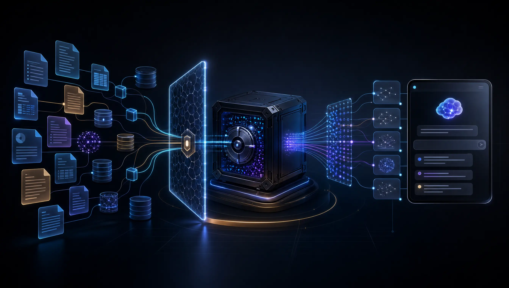

<div align="center">



# DOO MADE Knowledge Base

**An evidence-first knowledge architecture for humans and AI agents.**

Source provenance, governed retrieval, citations, and fail-closed access by design.

[](#project-status) [](#design-principles) [](docs/SECURITY_MODEL.md) [](LICENSE)

</div>

> [!IMPORTANT]
> This is the public design surface for the DOO MADE knowledge system. It contains architecture, contracts, synthetic examples, and agent guidance. It does **not** contain private evidence, credentials, infrastructure identities, evaluation questions, backups, or deployment state.

## Why this exists

AI agents can produce convincing answers long before they can produce trustworthy ones.

A useful company knowledge system must answer four questions before it generates a response:

1. **Where did this evidence come from?**
2. **Is the requester allowed to retrieve it?**
3. **Is it still active and current?**
4. **Can the answer point back to a real source location?**

This repository documents a practical architecture built around those questions. Original source systems remain authoritative. The knowledge database is a governed query index, not a replacement for source evidence.

## System architecture


The architecture separates four jobs:

| Layer | Responsibility | Core rule |
|---|---|---|
| **Approved sources** | Documents, media, conversations, and meeting evidence | Nothing enters without explicit authorization |
| **Governance** | Stable identity, checksums, provenance, deletion, and policy | Invalid metadata fails closed |
| **Governed index** | PostgreSQL records, structural chunks, full-text search, and pgvector | Filters never replace authorization |
| **Authorized answers** | Fusion, local reranking, relevance gates, and citations | Weak evidence produces abstention, not invention |

Read the deeper architecture note in [`docs/ARCHITECTURE.md`](docs/ARCHITECTURE.md).

## What is in this repository

| Path | Purpose |
|---|---|
| [`AGENTS.md`](AGENTS.md) | Operating contract for AI coding agents |
| [`.github/SECURITY.md`](.github/SECURITY.md) | Private vulnerability-reporting policy |
| [`docs/ARCHITECTURE.md`](docs/ARCHITECTURE.md) | Components, data lifecycle, and portability |
| [`docs/SECURITY_MODEL.md`](docs/SECURITY_MODEL.md) | Threat boundaries and fail-closed invariants |
| [`schemas/evidence-record.schema.json`](schemas/evidence-record.schema.json) | Normalized evidence and provenance contract |
| [`schemas/retrieval-response.schema.json`](schemas/retrieval-response.schema.json) | Citation-first retrieval response contract |
| [`examples/`](examples/) | Synthetic, publication-safe contract examples |
| [`scripts/validate_repo.py`](scripts/validate_repo.py) | Zero-dependency repository validator |

## Retrieval flow


The model does not get first access to the question. Retrieval establishes the evidence boundary first:

1. Bind the requester to an authorized scope.
2. Retrieve candidates with full-text and vector search.
3. Fuse independent rankings.
4. Rerank evidence locally where practical.
5. Reject weak support.
6. Construct source-ready citations.
7. Permit optional synthesis only inside an approved privacy boundary.

A query with no authorized evidence must return an honest abstention.

## Design principles

### Evidence before answers

The system returns evidence records and citations before it asks any model to write prose.

### Provenance is required data

Every record carries a stable source identity, checksum, source timestamp, content type, and citation-ready locator. Provenance is not optional metadata added later.

### Authorization is enforced below the prompt

Project names and UI filters are not security boundaries. Runtime access is tied to a least-privilege identity and an explicit entitlement.

### Deletion propagates immediately

When source evidence is deleted, active retrieval views stop exposing its derived artifacts and chunks. Physical retention can follow a separate policy.

### Evaluation stays separate from tuning

Real questions are kept in protected evaluation sets outside Git. Public fixtures are synthetic. Ranking changes must survive unseen challenge cases before promotion.

### Source systems stay authoritative

The index accelerates retrieval. It does not silently become the master copy of a document, meeting, message, or media file.

## Public and private boundaries


The boundary is deliberate:

**Safe to publish**

- Architecture and design principles
- Interface and schema contracts
- Synthetic examples
- Generic validation tools
- Agent contribution guidance

**Must remain private**

- Business documents and extracted evidence
- Credentials, endpoints, and database identities
- Real evaluation questions and reports
- Embeddings, corpora, caches, and model artifacts
- Backups, recovery files, and deployment receipts

See [`docs/SECURITY_MODEL.md`](docs/SECURITY_MODEL.md) before contributing anything that resembles runtime data.

## Source Wire integration

[Source Wire](https://github.com/DanielJD1216/Source-Wire) is a separate governed-memory layer. This knowledge base remains an optional external evidence system around it.

The planned integration is read-only:

1. An owner-controlled adapter implements Source Wire's authoritative [`KnowledgeProvider v1`](https://github.com/DanielJD1216/Source-Wire/blob/main/docs/contracts/knowledge-provider-v1-contract.md) contract against the knowledge-base retrieval surface.
2. Source Wire policy calls that adapter with an authorized identity, capability, and namespace.
3. The adapter returns evidence and provenance. It does not expose database access.
4. Provider evidence may support a pending memory candidate, but it cannot approve or promote trusted memory.
5. Source Wire does not write evidence into this knowledge base, and no private data flows into this public documentation repository.

Source Wire currently publishes the contract but does not include live knowledge connectors. This repository will not duplicate that contract. Its local evidence and retrieval schemas remain provider-neutral, and a future adapter must map them to the authoritative Source Wire types.

## For AI agents

Start with [`AGENTS.md`](AGENTS.md), then read the two documents in this order:

1. [`docs/SECURITY_MODEL.md`](docs/SECURITY_MODEL.md)
2. [`docs/ARCHITECTURE.md`](docs/ARCHITECTURE.md)

Before proposing a change, an agent must be able to state:

- Which trust boundary changes
- Which invariant protects that boundary
- Which schema or synthetic fixture changes
- How the change is validated
- Why no private operating data enters Git

Validate the repository with:

```bash
python3 scripts/validate_repo.py
```

## Project status

**Current release:** public reference architecture and contracts.

**Next release boundary:** a sanitized, read-only `KnowledgeProvider v1` adapter after Source Wire's live provider runtime boundary is ready.

Planned public work:

- [x] System architecture and trust-boundary diagrams
- [x] AI-agent operating contract
- [x] Evidence and retrieval schemas
- [x] Synthetic examples and repository validation
- [ ] Read-only Source Wire `KnowledgeProvider v1` adapter
- [ ] Sanitized reference ingestion path
- [ ] Reproducible local evaluation harness
- [ ] Runnable starter deployment after security review

This roadmap is intentionally staged. The public repo will not receive a hurried copy of the private production implementation.

## Repository philosophy

> Publish the pattern. Protect the evidence.

The goal is not to make another chatbot wrapper. The goal is to make evidence retrieval understandable, governable, testable, and useful to both people and software agents.

## Contributing

Issues and focused pull requests are welcome. Read [`CONTRIBUTING.md`](CONTRIBUTING.md) and [`AGENTS.md`](AGENTS.md) first.

Report vulnerabilities through [the private security process](.github/SECURITY.md), never through a public issue.

Never submit real company evidence, secrets, internal endpoint names, production identifiers, private benchmark questions, or generated embeddings.

## License

Apache License 2.0. See [`LICENSE`](LICENSE).

The license applies to the public material in this repository. It does not grant access to any private DOO MADE data, infrastructure, or unpublished implementation.

---

<div align="center">

Built by [DOO MADE](https://www.doomade.com/) for evidence-first AI systems.<br>
Follow the build on [YouTube](https://www.youtube.com/@Jinni_Doo).

</div>
