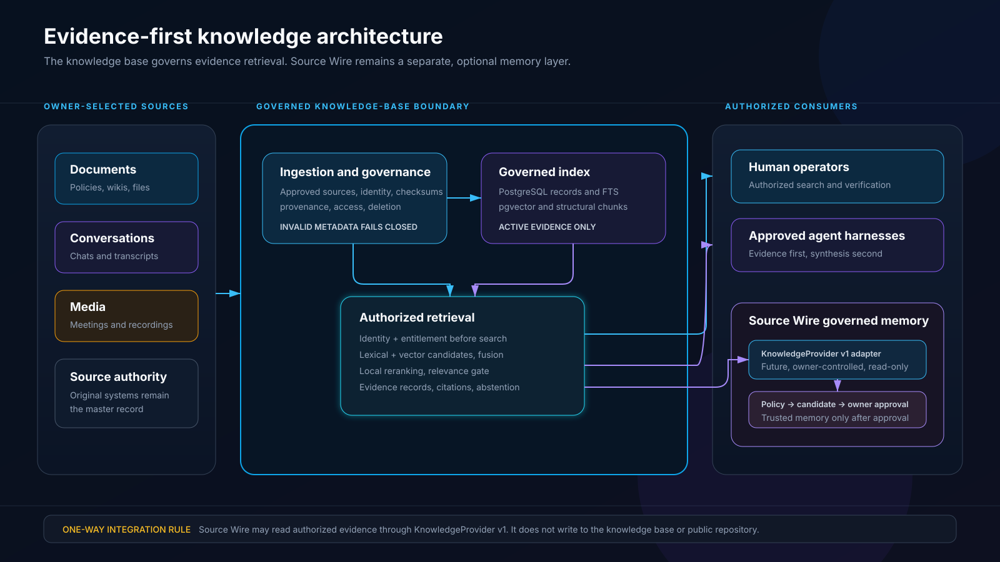
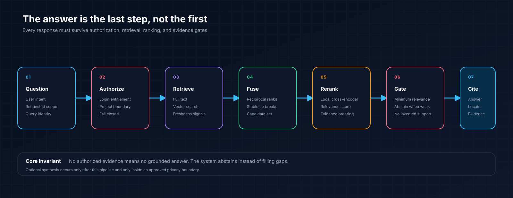

# Architecture

## Core model

The DOO MADE Knowledge Base is a governed query index of evidence. Original source systems remain authoritative.

The knowledge-base system has four layers:

1. Approved source ingestion
2. Normalization and governance
3. Governed evidence indexes
4. Authorized retrieval and citations

Source Wire is a separate governed-memory layer. A future integration may read authorized evidence from this knowledge base through Source Wire's `KnowledgeProvider v1` boundary.



## 1. Approved source ingestion

A source worker does not receive blanket permission to ingest everything it can see. Each source must be explicitly approved, and each change must carry enough context to preserve identity and provenance.

An implementation should require:

- Stable source and source-record identities
- An explicit operation such as upsert or delete
- Source timestamp
- Content checksum
- Citation-ready provenance
- Explicit access scope
- Idempotent replay behavior

This public repository does not define a universal source-ingestion protocol. Connector contracts are deployment-specific and must not be confused with Source Wire's knowledge-provider contract.

## 2. Normalization and governance

Normalization converts source-specific records into a portable evidence contract without stripping source meaning.

A normalized record includes:

- Stable evidence ID
- Original source identity
- Content type and body
- Verifiable checksum
- Source timestamp
- Ingestion timestamp
- Provenance locator
- Access scope and principals
- Consistent active or deleted state

The public record contract is defined in `schemas/evidence-record.schema.json`.

Invalid required metadata is rejected. It is safer to stop ingestion than to index evidence with guessed provenance or broadened access.

## 3. Governed evidence indexes

A portable implementation can use PostgreSQL plus pgvector:

- PostgreSQL relations hold evidence, derived artifacts, chunks, projects, deletion state, and watermarks.
- PostgreSQL full-text search provides exact and lexical retrieval.
- pgvector provides model-versioned semantic retrieval.
- Active views exclude deleted evidence and all dependent artifacts.
- Least-privilege functions expose only approved retrieval surfaces.

The architecture does not require a second vector database. The storage implementation may change as long as the contracts and security invariants remain intact.

## 4. Authorized retrieval



Retrieval proceeds in a fixed order:

1. Bind the runtime identity to an allowed scope.
2. Generate lexical and semantic candidates.
3. Fuse independent ranks.
4. Apply freshness or deterministic evidence signals where appropriate.
5. Rerank locally when practical.
6. Reject candidates below the evidence threshold.
7. Construct citations from stored provenance.
8. Return an answerable result or an explicit abstention.
9. Optionally synthesize prose inside an approved privacy boundary.

The answer model never grants access. It receives only evidence that the retrieval boundary has already authorized.

The public response contract is defined in `schemas/retrieval-response.schema.json`. Its state rules are fail-closed:

- `answered` requires at least one cited result and no abstention reason.
- `abstained` requires zero results and a non-empty reason.

## Source Wire boundary

[Source Wire](https://github.com/DanielJD1216/Source-Wire) is the governed memory layer, not this knowledge base's ingestion connector.

The planned relationship is:

```text
DOO MADE Knowledge Base
  -> owner-controlled, read-only KnowledgeProvider v1 adapter
  -> Source Wire policy and coordinator
  -> pending memory candidate
  -> explicit owner approval
  -> trusted memory
```

Boundary rules:

- The knowledge base remains optional and external to Source Wire.
- The adapter implements Source Wire's authoritative `KnowledgeProvider v1` contract.
- Access is read-only from Source Wire to the authorized retrieval surface.
- Provider evidence can support a pending memory candidate.
- Provider evidence cannot approve or promote trusted memory.
- Source Wire does not write evidence into the knowledge-base index.
- Neither private runtime has a connection to this public documentation repository.

Source Wire's latest source contains an unpublished `0.2.0` candidate for the
contract, but the currently published `0.1.0` package does not contain
`KnowledgeProvider v1`. Source Wire does not include live knowledge
connectors. This repository intentionally does not fork or duplicate that
contract.

The next adapter boundary is prepared in
[`SOURCE_WIRE_ADAPTER_STORY_1.md`](SOURCE_WIRE_ADAPTER_STORY_1.md). It keeps the
executable adapter beside a runnable knowledge-base retrieval boundary while
this public repository owns only portable contracts, mapping rules, synthetic
fixtures, and publication-safe conformance expectations. Implementation,
private credentials, real evidence, deployment, and production use remain
separately blocked. A published contract alone is not enough for integration:
Source Wire must also expose a supported immutable provider-host composition
surface.

## Evidence lifecycle

### Upsert

1. Receive an authorized source change through the deployment's ingestion boundary.
2. Verify schema and authorization context.
3. Normalize content and provenance.
4. Compare content hashes for idempotency.
5. Store or update the source record.
6. Rebuild changed artifacts, chunks, and embeddings.
7. Advance the source watermark after successful commit.

### Delete

1. Receive an authorized delete through the deployment's ingestion boundary.
2. Mark the source record inactive with a deletion timestamp.
3. Exclude all dependent evidence from active retrieval immediately.
4. Retain or physically purge data according to a separate retention policy.

### Query

1. Verify the runtime identity.
2. Verify scope entitlement.
3. Retrieve only active, authorized evidence.
4. Rank and gate results.
5. Return citations and evidence metadata, or abstain.
6. Record privacy-limited operational audit data.

## Portability

The public architecture uses standard PostgreSQL concepts plus pgvector. It does not require Supabase Auth, PostgREST, Realtime, Storage, or Edge Functions.

A hosted PostgreSQL provider can be used, but provider-specific identity layers must not be confused with the direct database authorization model.

## Observability

Operational monitoring should answer:

- Can the query-only identity call the approved retrieval surface?
- Are source watermarks advancing?
- Are delete events reflected in active retrieval?
- Are backup manifests current and verifiable?
- Are retrieval latency and result counts within expected bounds?

Monitoring should not log private question text or evidence bodies by default.

## Recovery

A production implementation should maintain:

1. Managed primary backups
2. A private database backup with checksum manifest
3. An encrypted operator-controlled recovery copy
4. A separate encrypted off-site copy
5. Scheduled isolated restore verification

An ownerless restore must reconstruct relation ownership, function ownership, ACLs, and default privileges before service access is restored.

## Non-goals

- Turning the index into the master copy of source evidence
- Publishing private corpora or embeddings
- Treating a project slug as authorization
- Sending private evidence to hosted models by default
- Optimizing directly against protected evaluation questions
- Claiming that localhost automatically makes downstream inference private
- Replacing or redefining Source Wire's authoritative contracts
