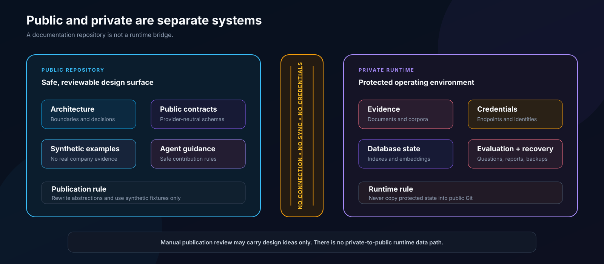

# Security Model

## Security goal

The knowledge system must return only active evidence that the runtime identity is explicitly allowed to retrieve, with provenance sufficient to verify the result.

A failure in metadata, identity, policy, or evidence quality must reduce capability rather than broaden access.

## Trust boundaries

### Public repository

Trusted to contain:

- Architecture
- Public contracts
- Synthetic examples
- Generic validators
- Contribution guidance

Not trusted to contain:

- Real evidence
- Production identities
- Private evaluation data
- Credentials
- Recovery state

The public repository has no runtime connection, synchronization path, or database access to a private deployment. Publication is a manual review process, and all public examples are synthetic.

### Source boundary

Trusted only after:

- The source is explicitly approved.
- The ingestion identity is authenticated.
- The deployment-specific source change passes schema validation.
- Stable identity and provenance are present.
- Access scope is explicit.

### Database boundary

Trusted to enforce:

- Least-privilege service identities
- Explicit scope entitlements
- Active/deleted filtering
- Narrow retrieval functions
- Privacy-limited auditing

The answer model is outside this authorization boundary.

### Optional synthesis boundary

Private evidence may cross this boundary only when an operator explicitly enables a provider whose privacy policy and data handling have been approved independently.

## Protected assets

- Original source content
- Normalized evidence and derived chunks
- Access mappings
- Credentials and endpoint metadata
- Embeddings and model caches
- Real evaluation cases and reports
- Backups and deployment receipts

## Threats and controls

| Threat | Control |
|---|---|
| An ingestion worker indexes an unapproved source | Explicit source allowlist and authenticated ingestion identity |
| Missing metadata broadens access | Required schema fields and fail-closed ingestion |
| A UI filter is mistaken for authorization | Database identity plus explicit entitlement |
| Deleted evidence remains searchable | Active views exclude source records and all derivatives |
| A model invents unsupported details | Relevance gate, citation requirement, and abstention |
| Logs expose private questions | Aggregate audit metadata without evidence bodies or question text |
| Public examples leak company details | Synthetic fixtures only and staged-file review |
| A restore reintroduces unsafe ownership | Recovery reconstructs owners, ACLs, and default privileges before service access |
| Hosted inference receives private data silently | Explicit operator opt-in and separately approved provider boundary |
| Ranking is tuned to a known test set | Protected holdout evaluation outside Git |
| A Source Wire adapter receives broader authority than retrieval requires | Adapter gets only a provider-owned principal, scope, bounded request, and deadline |
| Provider evidence is treated as trusted memory | Adapter returns `internal_unreleased`, no-mutation results and Source Wire retains audit, release, and owner-approval authority |

## Identity rule

A requested project or scope is only a filter. Permission must be derived from the authenticated runtime identity.

Changing an active database role must not silently change the entitlement identity. Implementations should bind authorization to the login identity or another non-forgeable principal.

## Data minimization

Store only what the retrieval and governance model requires.

Operational audits should prefer:

- Timestamp
- Runtime identity
- Requested scope
- Candidate count
- Result count
- Latency
- Pipeline version

Avoid storing:

- Raw question text
- Evidence bodies
- Generated answers
- Secret values

## Public contribution rule

Do not open an issue, pull request, or discussion containing:

- Real company evidence
- Private file paths
- Production endpoint names
- Secret-file names tied to a real deployment
- Database role membership output
- Backup manifests
- Real benchmark questions or expected citations

Replace private context with a synthetic example that preserves the technical shape.

## Disclosure

If you believe public material exposes a real security issue, do not include exploit details or private data in a public issue. Follow [the repository's private disclosure process](../.github/SECURITY.md).
